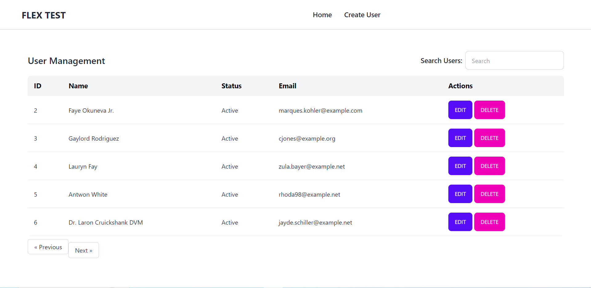
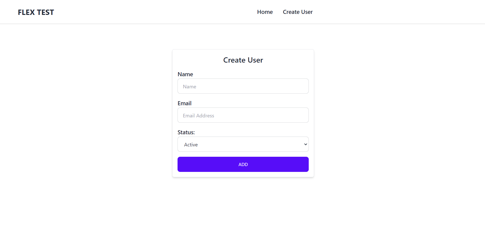
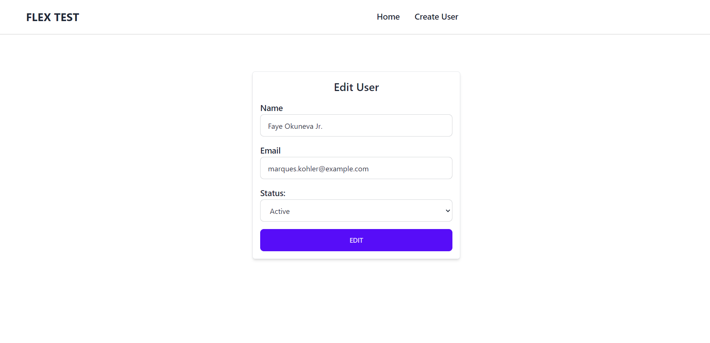
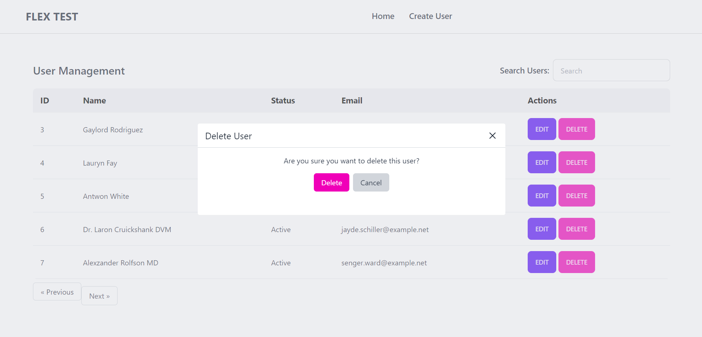
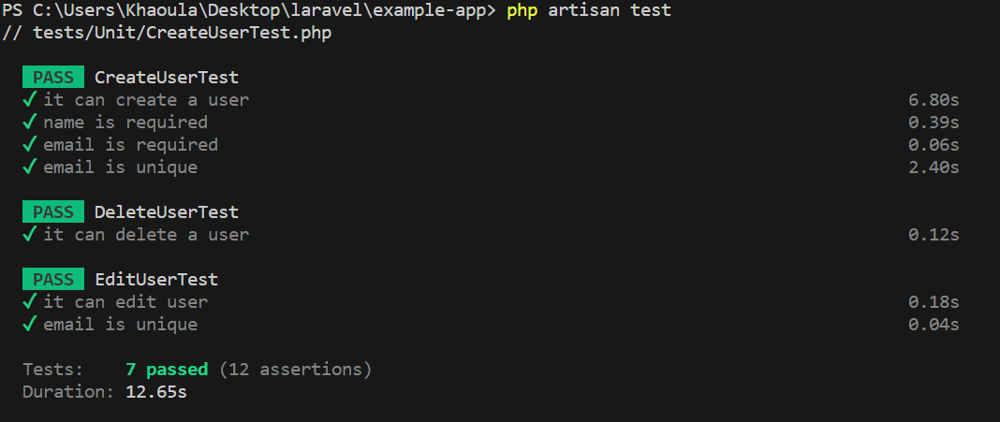

# Project Setup

composer install   
npm install    
cp .env.example .env 
Create a file database.sqlite inside folder database  
Change those lines in your .env  
DB_CONNECTION=sqlite  
DB_HOST=127.0.0.1 
DB_PORT=3306 
DB_DATABASE=path\to\your\project\database\database.sqlite 
DB_USERNAME=root 
DB_PASSWORD= 

npm install  
php artisan key:generate  
 php artisan migrate   
 php artisan db:seed --class=UsersTableSeeder 

 ## Run Project
 npm run dev 
 php artisan serve 

## Run Tests

php artisan test

# Website Preview
## Home

## Create User

## Edit User

## Delete User

## Test Result

